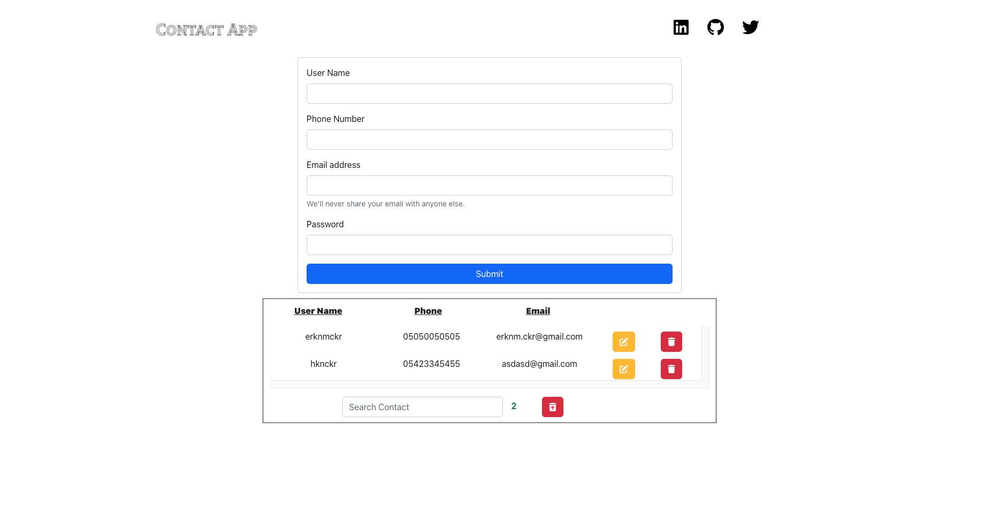

React Redux CRUD

# createEntityAdapter nedir ? 

createEntityAdapter, Redux Toolkit kütüphanesinde bulunan bir fonksiyondur. Bu fonksiyon, Redux uygulamalarında normalize edilmiş verileri yönetmek için kullanılan bir araçtır.

Normalize edilmiş veriler, verileri birçok farklı koleksiyon halinde saklamak yerine, tek bir yerde saklamak ve farklı koleksiyonlar arasındaki ilişkileri referanslarla belirtmek anlamına gelir. Bu yaklaşım, uygulamaların verileri daha kolay yönetmelerini, daha hızlı ve daha az hafıza kullanarak verileri sorgulamalarını ve güncellemelerini sağlar.

- getInitialState: Store'da kullanılmak üzere varsayılan bir başlangıç durumu sağlar.
- getSelectors: Store'dan verileri seçmek için kullanılan bir dizi özel işlev sağlar.
- getById: Veri kimliği ile bir öğe seçmek için kullanılır.
- getIds: Veri koleksiyonunun kimliklerini seçmek için kullanılır.
- getTotal: Veri koleksiyonundaki öğelerin toplam sayısını verir.
- addOne: Bir öğe eklemek için kullanılır.
- addMany: Birden fazla öğe eklemek için kullanılır.
- setOne: Bir öğeyi güncellemek için kullanılır.
- setMany: Birden fazla öğeyi güncellemek için kullanılır.
- removeOne: Bir öğeyi silmek için kullanılır.
- removeMany: Birden fazla öğeyi silmek için kullanılır.
- removeAll: Tüm öğeleri silmek için kullanılır.

Kısacası, createEntityAdapter, normalize edilmiş verileri yönetmek için kullanılan bir araçtır ve Redux Toolkit ile birlikte kullanarak, uygulamalarınızın verilerini daha kolay ve etkili bir şekilde yönetebilirsiniz.

### import { nanoid } from "@reduxjs/toolkit";

# font awesome kutuphanesi 
npm install --save @fortawesome/fontawesome-svg-core
npm install --save @fortawesome/free-brands-svg-icons
npm install --save @fortawesome/react-fontawesome

import { library } from '@fortawesome/fontawesome-svg-core';
import { fab } from '@fortawesome/free-brands-svg-icons';
import { FontAwesomeIcon } from '@fortawesome/react-fontawesome';
library.add(fab);

