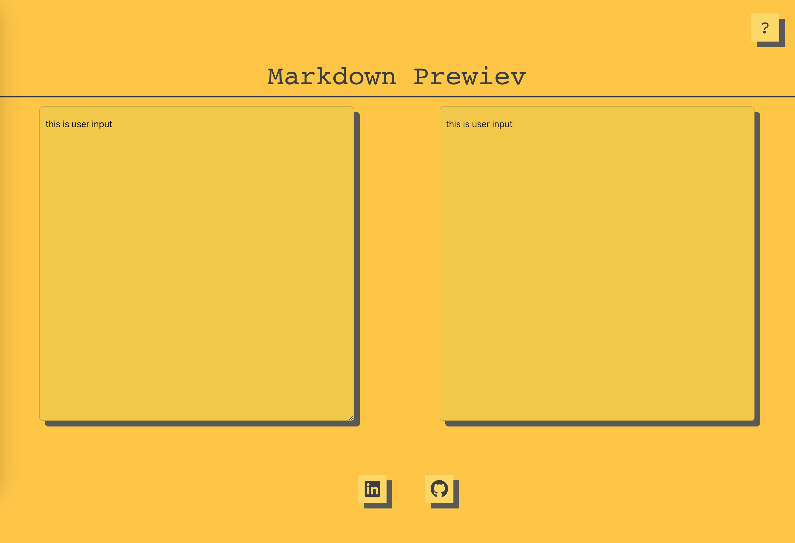

## Marked

- npm install marked & yarn add marked

- JSX, HTML benzeri bir sözdizimine sahip olsa da, aslında bir JavaScript kodudur ve içerisinde HTML kodu yazmak mümkün değildir.

useDispatch fonksiyonu, Redux store'a erişim sağlayarak state değiştirme işlemlerini gerçekleştirmek için kullanılır.useSelector fonksiyonu ise store'dan belirli bir state'in alınmasını sağlar.

* <textarea readOnly={isHelpOkey} onChange={handleChange} value={textCurrent} className='left_page col-6 card'>

readOnly özelliği bir input veya textArea'nın içeriğinin kullanıcının degıstırmesını engeller. Bu ozellık kullanıldıgında ilgili eleman sadece okunabılır hale gelır ve kullanıcı ıcerıgı degıstıremez. Yukarıdaki kod satırında isHelpOkey parametresı true degere sahıp oldugu zaman textArea sadece onızleme halınde gozukecek

- dangerouslySetInnerHTML={processedText}

Asagıda markdown olarak gelen verıyı html formatına donusturduk 18.satır (parseHtml) ardından 
- const parseHtml = marked(textCurrent, {sanitize:true});
- const processedText = { __html: parseHtml };

-  <!--  

 
 -->

Yukarıdaki dangerouslySetInnerHTML özelliği HTML ozellıgını dogrudan bır react bılesenıne aktarmaya yarar. Bu özellik object turunde veri alır ve bu object gostermek ıstedıgımız html taglarına sahıp strıng bır verıdır . Bu ozellık genellıkle bır apiden veya baska bır kaynaktan dınamık olarak alinan HTML içeriğini göstermek ıcın kullanılır. 

Özellikle, React uygulamalarında normalde HTML içeriği oluşturmak için JSX kullanılır. Ancak bazen JSX'in yetersiz kaldığı durumlarda dangerouslySetInnerHTML özelliği kullanılabilir. Bu özellik, adından da anlaşılacağı gibi "tehlikeli" olarak nitelendirilir, çünkü doğrudan HTML kodu yazmanıza ve böylece güvenlik açıklarına neden olabilecek kodlar yazmanıza izin verir.

