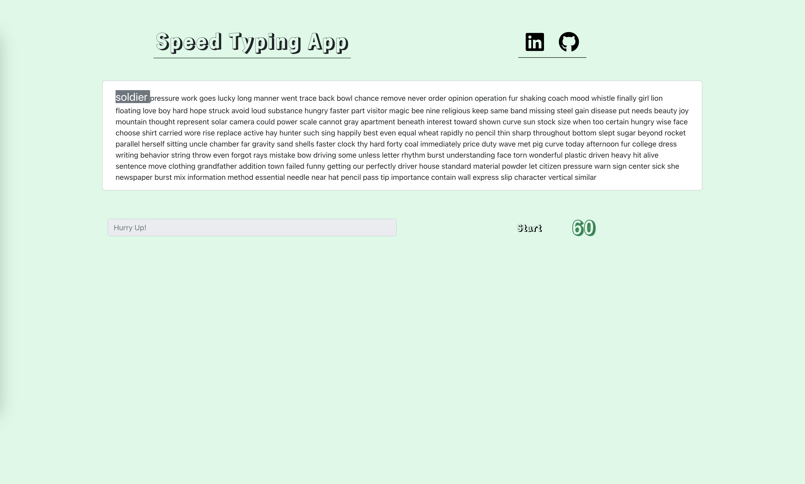

# Speed Typing App
- React
- Redux Toolkit
- Bootstrap
- Fontawesome
- random words library 

### useCallback hook ->
useCallback hook'u React fonksiyon bileşenlerinde performansı artırmak için kullanılır. Bileşenler, bağımlılıklarına bağlı olarak yeniden oluşturulur. Bu nedenle, bir işlev bileşenin bağımlılıklarına bağlıysa, her render işlemi sırasında farklı bir işlev referansı oluşturulur. Bu, bağımlılıkları olan işlevlerin yeniden oluşturulmasına neden olabilir ve nihayetinde performans sorunlarına yol açabilir.

useCallback hook'u, bir işlevin hatırlanmasını sağlayarak, işlevi yalnızca bağımlılıkları değiştiğinde yeniden oluşturulmasını engeller. Bu şekilde, işlev yeniden oluşturulmaz ve performans sorunları önlenir.

useCallback hook'u genellikle, bir işlevin, başka bir bileşenin prop'u veya bağımlılık dizisi gibi bir değere bağlı olduğu durumlarda kullanılır. Bu durumda, prop veya bağımlılık dizisi değiştiğinde işlev yeniden oluşturulur.

const handleStart = () => {
  dispatch(startHandle(ınputValue));
};

yukarıdaki fonksıyonu useEffect ıcınde kullanıyorduk ve hata aldık 

useEffect(()=>{
  if(status==="started"){
    setTimeout(()=>{handleStart()},1000)
  }
},[timerDown,status,handleStart])

useEffect içindeki diziye handleStart eklememizin sebebi, eğer bu fonksiyon değişirse veya herhangi bir bağımlılığı değişirse, bu kullanımın etkilendiği komponentin yeniden render edilmesi gerekiyor. Ancak bu yöntem, handleStart fonksiyonu her render işlemi için yeniden oluşturulacağından, her seferinde yeni bir referans elde edecektir. Bu durumda, useEffect'in bağımlılık dizisi bir önceki render'deki referansla karşılaştırılamadığından, her seferinde yeni bir zamanlayıcı oluşturulacaktır. Bu işlem performans sorunlarına ve beklenmeyen davranışlara neden olabilir.

Bu nedenle, useCallback fonksıyonu kullanarak sadece handleStart fonksıyonunun bagımlılıkları degıstıgınde render edılmesını sağlayabılırız. useEffect tarafından render a sebeb oldugunda yenı bır referans degerı olusturmak yerıne bir oncekı referansı dondurür.

const handleStart = useCallback(() => {
  dispatch(startHandle(ınputValue));
}, [dispatch, ınputValue]);

Yukarıda, useCallback fonksiyonu iki argüman alır:

Fonksiyonun kendisi: Burada dispatch ve ınputValue parametreleriyle birlikte önceki örnekteki gibi startHandle işlevini tetikleyen handleStart fonksiyonumuzu veriyoruz.

Bağımlılıkların listesi: Burada dispatch ve ınputValue bağımlılıklarını belirtiyoruz. Bu, bu fonksiyonun yeniden oluşturulması gerektiği bağımlılıkları tanımlar.

Bu sayede, handleStart fonksiyonu, bağımlılıkları değiştiğinde yeniden oluşturulacak, ancak bağımlılıkları değişmediğinde aynı referansı kullanacaktır.

