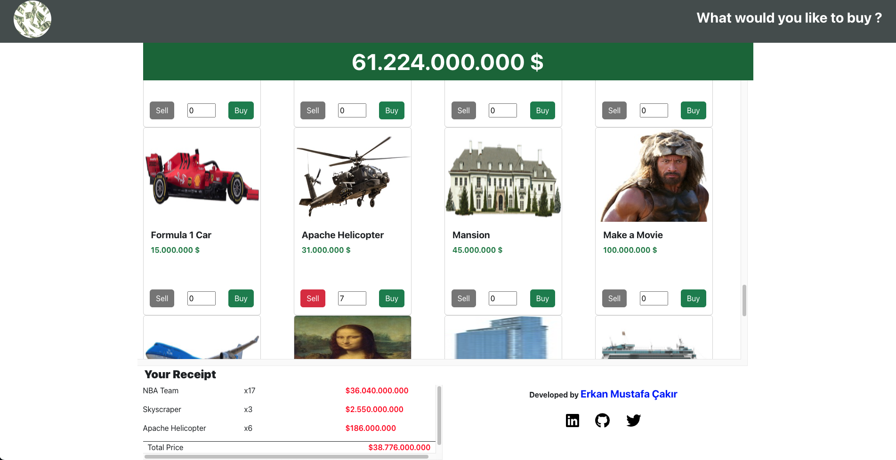

# Spend Money App
- React Redux
- Redux/toolkit
- Bootstrap
- Font Awesome
- Localstorages

npm install @fortawesome/fontawesome-svg-core
npm install @fortawesome/free-solid-svg-icons
npm install @fortawesome/react-fontawesome

import { library } from '@fortawesome/fontawesome-svg-core';
import { faUser } from '@fortawesome/free-solid-svg-icons';
import { FontAwesomeIcon } from '@fortawesome/react-fontawesome';

library.add(faUser);

